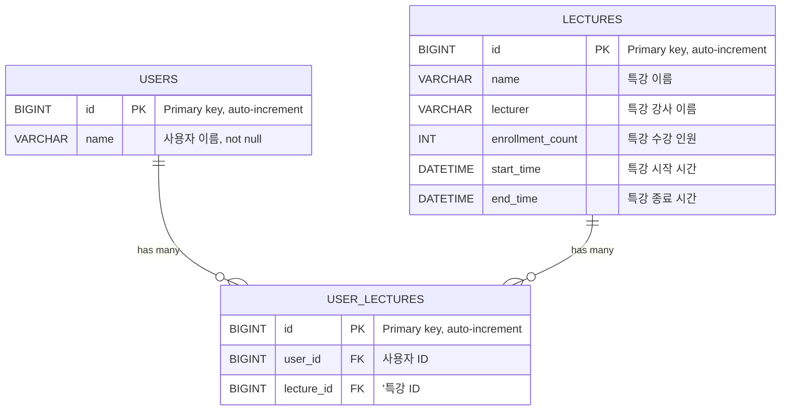

# 설계한 테이블 ERD 및 이유

## ERD

## 테이블 설계 이유

가장 최소한의 테이블만으로 특강 신청 시스템을 구축하는 것을 목표로 다음과 같이 3개의 테이블을 구성했습니다.
- USERS: 사용자 정보를 저장하는 테이블
- LECTURES: 특강 정보를 저장하는 테이블
- USER_LECTURES: 사용자와 특강의 관계를 저장하는 테이블

### 특강 테이블에 현재 수강 인원을 추가한 이유
강의 테이블에 현재 수강 인원을 추가한 이유는 수강 신청시 동시성 문제를 회피하기 위해 비관적락을 사용할 예정인데 USER_LECTURES 테이블에
카운트 쿼리를 날리는 방식인 경우 비관적락을 걸 대상이 없어 동시성 문제를 제어할 방법이 없어 추가했습니다.

### 개선 방향
- 특강 테이블을 정규화하면 Lock을 거는 범위와 특강 강사 이름이나 특강 이름이 중복되는 상황에서 변경시에 변경되는 부분을 최소화할 수 있을 것 같습니다.

